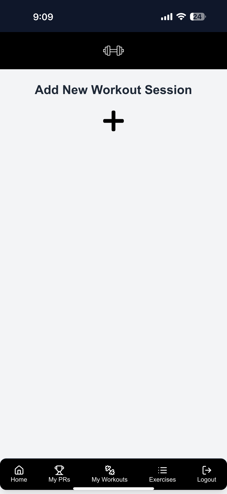
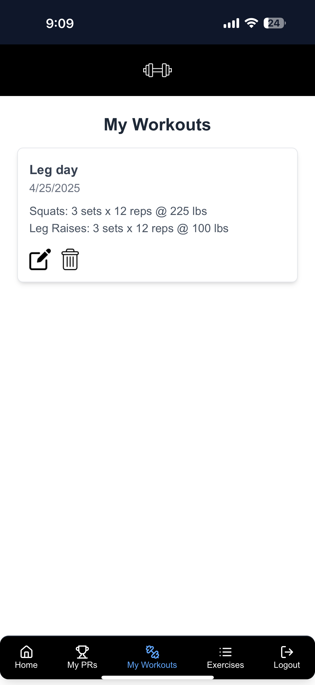
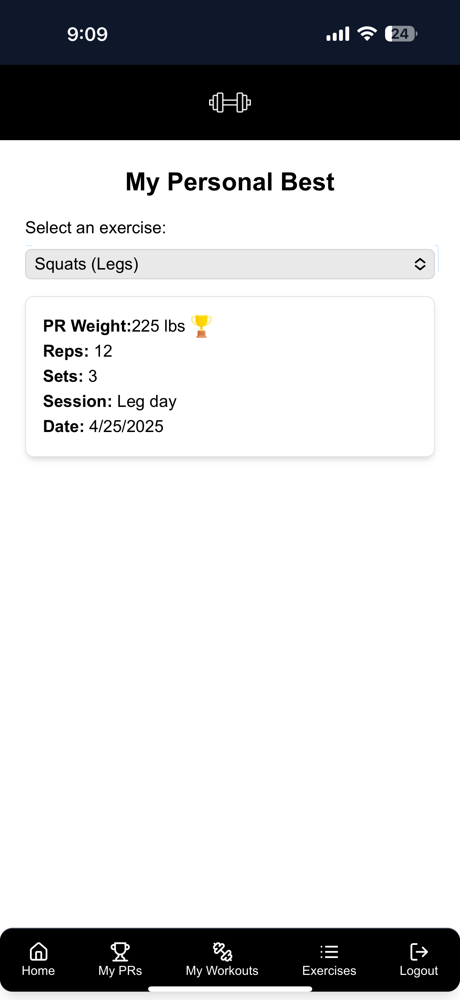

# 🏋️‍♂️ Workout Tracker

A full-stack Progressive Web App (PWA) to log and manage your workout sessions. Built with modern web technologies for performance, scalability, and ease of use.

🔗 **Live Site**: [https://workout-tracker-azure.vercel.app/auth/login](https://workout-tracker-azure.vercel.app/auth/login)

## 🚀 Features

- 🔐 Secure login with **NextAuth.js**
- 🗓️ Track workouts, exercises, sets, reps, and weight
- 📲 **Installable PWA** – works offline and feels like a native app
- ⚡ Lightning-fast performance with **Next.js**
- 🎨 Sleek and responsive UI powered by **Tailwind CSS**
- ☁️ Deployed on **Vercel**, with database hosted by **Neon**

## 📸 Screenshots

  
  &nbsp;
  
  &nbsp;
  

## 🛠️ Tech Stack

| Tech         | Purpose                             |
| ------------ | ----------------------------------- |
| Next.js      | Full-stack React framework          |
| Prisma       | ORM for database management         |
| NextAuth     | Authentication and session handling |
| Tailwind CSS | Utility-first styling               |
| PWA          | Offline support and installability  |
| Neon         | Serverless PostgreSQL database      |
| Vercel       | Hosting and serverless deployment   |
